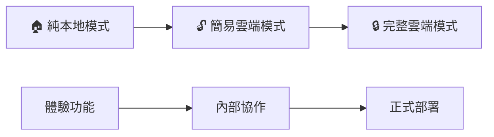

# 🔥 Firebase 設定指南

## 快速開始

本專案支援兩種運行模式：
1. **本地模擬模式** - 無需 Firebase 專案，適合開發和測試
2. **雲端模式** - 需要真實的 Firebase 專案，適合生產環境

## 🏠 本地模擬模式（推薦新手）

使用 `http://localhost:xxxx` 訪問應用時會自動使用本地模擬模式：
- ✅ 無需註冊 Firebase 帳號
- ✅ 無需設定任何配置
- ✅ 所有功能完整可用
- ✅ 數據存儲在瀏覽器記憶體中

## ☁️ 雲端模式設定

### 🚀 選擇設定方式

根據您的需求選擇適合的設定方式：

- **🔓 快速設定（低安全性）** - 適合內部團隊使用，設定簡單快速
- **🔒 安全設定（推薦）** - 適合正式環境，包含完整的安全措施

---

## 🔓 快速設定（低安全性模式）

⚠️ **重要提醒：本設定僅適用於內部團隊使用，請勿用於公開或生產環境！**

### 步驟 1: 建立 Firebase 專案
1. 前往 [Firebase Console](https://console.firebase.google.com/)
2. 點擊「建立新專案」
3. 輸入專案名稱（例如：`scrum-poker-team`）
4. **不需要啟用 Google Analytics**
5. 點擊「建立專案」

### 步驟 2: 設定 Realtime Database
1. 在左側選單點擊「Realtime Database」
2. 點擊「建立資料庫」
3. **選擇任何位置**（建議選擇離您較近的位置）
4. **選擇「以測試模式啟動」**（重要！）
5. 點擊「完成」

### 步驟 3: 設定安全規則（完全開放）
1. 在 Realtime Database 頁面，點擊「規則」標籤
2. **完全替換**現有規則為以下內容：
   ```json
   {
     "rules": {
       ".read": true,
       ".write": true
     }
   }
   ```
3. 點擊「發布」

⚠️ **注意**：這個規則允許任何人讀寫您的資料庫，僅適合內部使用！

### 步驟 4: 取得專案配置
1. 點擊左側的「專案設定」（齒輪圖示）
2. 在「一般」標籤中，找到「您的程式」區域
3. 點擊「Web 程式」圖示（`</>`）
4. 輸入程式名稱（例如：`Scrum Poker`）
5. **不需要設定 Firebase Hosting**
6. 點擊「註冊程式」

### 步驟 5: 在程式中輸入配置
1. 開啟 Scrum Poker 程式
2. 在登入頁面找到「Firebase 配置」區域
3. 輸入從 Firebase Console 複製的：
   - **Firebase Project ID**：您的 `projectId`
   - **Firebase API Key**：您的 `apiKey`（以 AIza 開頭）
4. 點擊「測試連線」確認設定正確
5. 點擊「🔥 啟用團隊模式」

✅ **完成！** 您的團隊現在可以使用即時協作功能了！

---

## 🔒 安全設定（推薦用於正式環境）

### 步驟 1: 創建 Firebase 專案

1. 前往 [Firebase Console](https://console.firebase.google.com/)
2. 點擊「新增專案」
3. 輸入專案名稱（例如：`my-scrum-poker`）
4. 完成專案創建

### 步驟 2: 啟用必要服務

#### 啟用 Authentication
1. 在 Firebase Console 中選擇你的專案
2. 前往「Authentication」→「登入方法」
3. 啟用「匿名」登入方式

#### 啟用 Realtime Database
1. 前往「Realtime Database」
2. 點擊「建立資料庫」
3. 選擇地區（建議選擇亞洲地區以獲得更好性能）
4. 選擇「以測試模式啟動」（稍後會設定安全規則）

### 步驟 3: 取得專案配置

1. 前往「專案設定」（齒輪圖標）
2. 選擇「一般」分頁
3. 在「你的程式」區塊中，點擊「</> Web」
4. 註冊程式（輸入任何名稱）
5. 複製 `firebaseConfig` 物件中的值

### 步驟 4: 配置程式

1. 打開 `firebase-config.js` 文件
2. 將以下欄位替換為你的真實值：
   ```javascript
   const firebaseConfig = {
       apiKey: "你的-api-key",                    // 從 Firebase Console 複製
       authDomain: "你的-project-id.firebaseapp.com",
       databaseURL: "https://你的-project-id-default-rtdb.firebaseio.com/",
       projectId: "你的-project-id",               // 從 Firebase Console 複製
       storageBucket: "你的-project-id.appspot.com",
       messagingSenderId: "123456789012",
       appId: "1:123456789012:web:demo-app-id"
   };
   ```

### 步驟 5: 設定安全規則

1. 前往「Realtime Database」→「規則」
2. 將 `firebase-rules.json` 的內容複製並貼上
3. 點擊「發布」

## 🔒 安全說明

### 已包含的安全措施
- ✅ 完整的數據匿名化處理
- ✅ 50天自動數據清理政策
- ✅ Firebase Rules 權限控制
- ✅ 輸入驗證和清理

### API 金鑰安全性
Firebase Web API 金鑰是安全的公開配置：
- ✅ 可以安全地包含在客戶端代碼中
- ✅ 真正的安全控制由 Firebase Rules 提供
- ✅ 限制了訪問權限和數據結構

## 🧪 測試配置

使用測試頁面驗證設定：
- `test-firebase-learning.html` - Firebase 學習系統測試
- `test-main-app-integration.html` - 主應用整合測試

## ❓ 疑難排解

### 常見錯誤

**🔓 低安全性模式相關問題**

**連線測試失敗**
1. 確認 Project ID 和 API Key 正確（沒有多餘空格）
2. 確認 API Key 以 `AIza` 開頭
3. 檢查 Realtime Database 規則是否設定為：
   ```json
   {
     "rules": {
       ".read": true,
       ".write": true
     }
   }
   ```
4. 確認專案的 Realtime Database 已經建立

**auth/configuration-not-found 錯誤**
- 這表示嘗試使用身份驗證但未正確設定
- 使用低安全性模式時已跳過身份驗證，此錯誤不應出現
- 如果出現，請確認使用最新版本的程式碼

**🔒 安全模式相關問題**

**permission_denied 錯誤**
- 確認已啟用匿名身份驗證
- 檢查 Firebase Rules 是否正確部署
- 確認專案 ID 和 API 金鑰正確

**連線失敗**
- 檢查網路連線
- 確認 Firebase 專案是否啟用了 Realtime Database
- 檢查瀏覽器控制台的詳細錯誤信息

**本地模式不工作**
- 確認使用 `http://localhost:xxxx` 訪問
- 不要使用 `file://` 協議
- 建議使用 `python3 -m http.server 8088` 啟動本地服務器

---

## 💰 成本與限制

### 💳 Firebase 免費方案

**Realtime Database 免費額度**
- 📊 **儲存空間**：1GB
- 🌐 **資料傳輸**：每月 10GB
- 👥 **同時連線**：100 個
- 📈 **操作次數**：不限

**實際使用評估**
- 🏢 **小團隊（5-10人）**：完全在免費額度內
- 🏗️ **中型團隊（20-50人）**：通常不會超過限制
- 🏭 **大型組織（100+人）**：可能需要升級付費方案

**成本估算範例**
```
10人團隊，每天2小時使用：
- 資料儲存：< 1MB
- 每月傳輸：< 100MB
- 成本：$0（免費方案足夠）
```

### 📋 建議與最佳實踐

**效能優化**
- ✅ 設定自動資料清理（24小時）
- ✅ 使用單向資料綁定
- ✅ 批次更新減少 API 呼叫

**成本控制**
- 🔧 在 Firebase Console 設定預算提醒
- 📊 定期檢查使用量統計
- ⚙️ 考慮使用 Firebase Emulator 進行開發測試

---

## 🎯 模式選擇建議

### 🤔 如何選擇適合的模式？

**🏠 純本地模式**
```
適合：個人使用、離線演示、功能測試
優點：零設定、完全離線、隱私保護
限制：無法跨裝置同步
```

**🔓 簡易雲端模式**
```
適合：內部團隊、快速開始、敏捷開發
優點：設定簡單、功能完整、即時協作
注意：僅適合信任的使用者
```

**🔒 完整雲端模式**
```
適合：正式環境、外部用戶、長期維護
優點：完整安全、權限控制、可擴展
成本：設定較複雜
```

### 📈 升級路徑



**建議流程**
1. **先體驗**：使用純本地模式了解功能
2. **團隊試用**：升級到簡易雲端模式
3. **正式部署**：最終升級到完整雲端模式

---

## 📞 支援與資源

### 🆘 獲得協助

**問題排查步驟**
1. 🔍 檢查瀏覽器控制台錯誤訊息
2. 📋 參考上方疑難排解區域
3. 🧪 使用內建測試功能診斷
4. 📊 檢查 Firebase Console 專案狀態

**有用的資源**
- 📖 [Firebase 官方文件](https://firebase.google.com/docs/database)
- 🎮 [專案 README](README.md) - 完整使用指南
- 🤖 [CLAUDE.md](CLAUDE.md) - 開發協作指南
- 🛠️ [本地開發指南](LOCAL_DEVELOPMENT_GUIDE.md)

### 🔗 相關連結

**專案文件**
- [使用者指南](README.md)
- [開發者文件](CLAUDE.md)
- [Firebase 安全規則](firebase-rules.json)
- [專案設定](package.json)

**外部資源**
- [Firebase Console](https://console.firebase.google.com/)
- [Firebase Pricing](https://firebase.google.com/pricing)
- [Scrum Poker 遊戲規則](game-rules.md)

### 🎯 快速起步清單

**首次使用者**
- [ ] 決定使用模式（本地/簡易雲端/完整雲端）
- [ ] 按照相應設定指南執行
- [ ] 測試基本功能（投票、開牌、統計）
- [ ] 邀請團隊成員加入測試

**開發者**
- [ ] 閱讀 [CLAUDE.md](CLAUDE.md) 了解專案架構
- [ ] 設定本地開發環境
- [ ] 執行自動化測試確認功能
- [ ] 熟悉事件驅動架構和 Firebase 整合

---

**🎉 開始您的敏捷估點之旅！**

*最後更新: 2025-01-14*  
*版本: v3.2.0 Desktop/Mobile 雙版本架構*