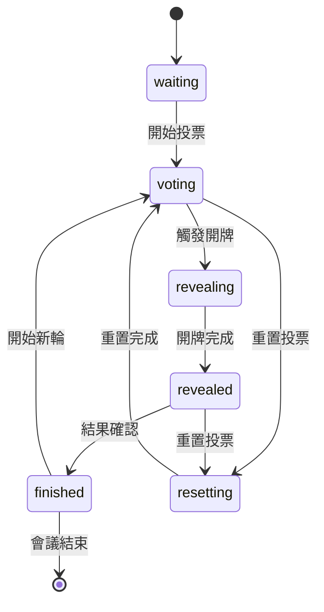
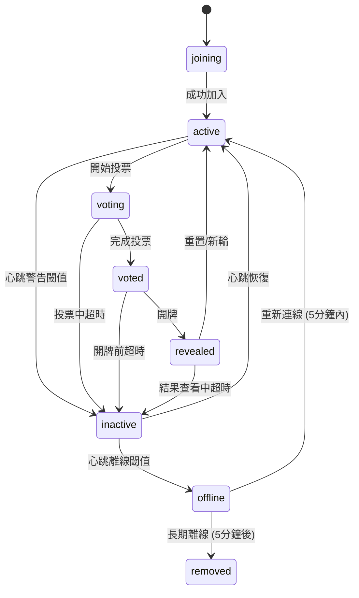
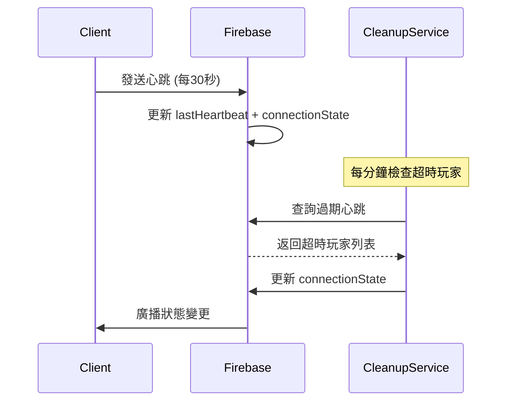

# 心跳機制與使用者狀態管理系統規格

**版本**: 2.0.0  
**建立日期**: 2025-01-12  
**v2 更新日期**: 2025-01-12  
**作者**: Claude AI  
**適用架構**: Scrum Poker v4.0+

---

## 🔄 v2 更新摘要

### 主要變更重點

1. **狀態欄位精簡化**
   - 移除冗餘的 `online` 欄位，統一使用 `connectionState: "active" | "inactive" | "offline"`
   - 移除 `graceperiodStart` 欄位，改由 `lastSeen + gracePeriod` 動態計算

2. **重連邏輯簡化**
   - 複雜的 4 種重連類型簡化為 2 種：
     - **Graceful Rejoin** (5分鐘內) → 恢復前次狀態
     - **Fresh Join** (5分鐘以上) → 視為新加入玩家

3. **Firebase Schema 最佳化**
   - 精簡資料結構，移除冗餘欄位
   - 優化 `broadcasts` 機制，加入頻率控管建議
   - 簡化索引策略

4. **實作複雜度降低**
   - 減少狀態判斷邏輯的複雜性
   - 簡化測試案例
   - 降低同步錯亂風險

---

## 📋 目錄

1. [功能目標](#1-功能目標)
2. [遊戲階段與狀態定義](#2-遊戲階段與狀態定義)
3. [玩家狀態生命週期](#3-玩家狀態生命週期)
4. [Firebase 欄位設計](#4-firebase-欄位設計)
5. [心跳機制](#5-心跳機制)
6. [玩家加入與重連邏輯](#6-玩家加入與重連邏輯)
7. [狀態同步與版本控制](#7-狀態同步與版本控制)
8. [容錯處理與失敗案例](#8-容錯處理與失敗案例)
9. [效能最佳化考量](#9-效能最佳化考量)
10. [可擴充性與未來發展](#10-可擴充性與未來發展)

---

## 1. 功能目標

### 1.1 核心目標

本系統旨在為多人在線 Scrum Poker 估點工具提供穩健的使用者狀態管理與心跳機制，特別針對以下場景進行最佳化：

- **長時間會議支援**：支援 30-90 分鐘的敏捷估點會議
- **討論友善設計**：允許玩家在討論期間暫時不互動而不被踢出
- **角色差異化管理**：不同角色（SM、PO、Dev、QA）有不同的活躍度要求
- **斷線恢復能力**：支援網路中斷後的狀態完整恢復

### 1.2 使用情境

#### 1.2.1 典型估點會議流程
```
會議開始 → 玩家陸續加入 → 討論 Story → 投票 → 開牌 → 
討論結果 → 重新投票(可選) → 下一 Story → ... → 會議結束
```

#### 1.2.2 關鍵使用情境
- **晚到加入**：玩家可在任何階段加入，立即同步當前狀態
- **暫離討論**：玩家可暫時不互動（如聽取討論）而不被踢出
- **網路不穩**：短暫斷線後能自動重連並恢復狀態
- **多輪估點**：支援多個 Story 的連續估點流程

### 1.3 性能指標

- **心跳延遲**: < 500ms 99.9%
- **狀態同步**: < 1s 跨所有客戶端
- **斷線容忍**: 最多 5 分鐘優雅期
- **重連成功率**: > 95% 在 30 秒內

---

## 2. 遊戲階段與狀態定義

### 2.1 遊戲階段 (Game Phases)

系統支援以下 6 個遊戲階段：

| 階段 | 值 | 描述 | 玩家可執行動作 |
|------|----|----|----------------|
| 等待中 | `waiting` | 等待玩家加入 | 加入房間、設定角色 |
| 投票中 | `voting` | 玩家選擇估點卡牌 | 選擇卡牌、修改投票 |
| 開牌中 | `revealing` | 開牌過渡狀態 | 觀看 (無互動) |
| 已開牌 | `revealed` | 顯示投票結果 | 查看結果、討論 |
| 已完成 | `finished` | 本輪估點完成 | 查看統計、準備下輪 |
| 重置中 | `resetting` | 重置過渡狀態 | 觀看 (無互動) |

### 2.2 階段轉換規則



### 2.3 跨階段加入支援

**原則**: 玩家可在任何階段加入，但需立即同步到當前狀態。

| 加入階段 | 同步內容 | 玩家狀態 |
|----------|----------|----------|
| `waiting` | 房間基本資訊 | 等待開始 |
| `voting` | 已投票玩家數、剩餘時間 | 可立即投票 |
| `revealing` | 開牌進度 | 觀看開牌 |
| `revealed` | 完整投票結果 | 查看結果 |
| `finished` | 統計數據、歷史 | 查看報告 |

---

## 3. 玩家狀態生命週期

### 3.1 玩家連線狀態 (簡化版)



### 3.2 連線狀態定義 (v2 精簡版)

#### 3.2.1 基本連線狀態

| 狀態 | 值 | 定義 | 觸發條件 | UI 顯示建議 |
|------|----|----|----------|-------------|
| 活躍 | `active` | 正常參與遊戲 | 定期心跳，有互動 | 🟢 綠色圓點 |
| 不活躍 | `inactive` | 暫時不響應 | 心跳超時警告閾值 | 🟡 黃色圓點 |
| 離線 | `offline` | 連線中斷 | 心跳完全超時 | 🔴 紅色圓點 |

> **v2 變更**: 移除了 `joining`, `voting`, `voted`, `revealed`, `removed` 等複雜狀態，簡化為 3 個核心連線狀態。遊戲階段狀態由 `room.phase` 和玩家的 `hasVoted`, `isRevealed` 等欄位組合表示。

#### 3.2.2 狀態轉換觸發時機

```javascript
// v2 簡化的狀態轉換邏輯
const STATE_TRANSITIONS = {
    'active': {
        to: 'inactive',
        condition: 'heartbeat_warning_threshold',
        timeout: '70% of role_timeout'
    },
    'inactive': {
        to: 'offline', 
        condition: 'heartbeat_offline_threshold',
        timeout: '100% of role_timeout'
    },
    'offline': {
        to: 'removed',
        condition: 'cleanup_threshold',
        timeout: '200% of role_timeout'
    }
};
```

### 3.3 角色差異化管理

不同角色有不同的超時設定，反映其在會議中的重要性：

| 角色 | 超時時間 | 警告閾值 | 離線閾值 | 移除閾值 | 理由 |
|------|----------|----------|----------|----------|------|
| Scrum Master | 60分鐘 | 42分鐘 | 60分鐘 | 120分鐘 | 會議主持人，可能需要協調其他事務 |
| Product Owner | 60分鐘 | 42分鐘 | 60分鐘 | 120分鐘 | 決策者，可能需要諮詢其他人 |
| Developer | 45分鐘 | 31.5分鐘 | 45分鐘 | 90分鐘 | 主要參與者，但可能有技術討論 |
| QA Tester | 45分鐘 | 31.5分鐘 | 45分鐘 | 90分鐘 | 重要參與者，類似開發者 |
| Other | 45分鐘 | 31.5分鐘 | 45分鐘 | 90分鐘 | 一般參與者 |

---

## 4. Firebase 欄位設計

### 4.1 完整資料結構 (v2 精簡版)

```json
{
  "rooms": {
    "roomId": {
      "phase": "waiting|voting|revealing|revealed|finished|resetting",
      "phaseVersion": 1,
      "phaseTimestamp": 1641234567890,
      "createdAt": 1641234567890,
      "lastActivity": 1641234567890,
      "taskType": "frontend|backend|fullstack|mobile_app",
      
      "players": {
        "playerId": {
          "name": "玩家名稱",
          "role": "dev|qa|scrum_master|po|other",
          "joinedAt": 1641234567890,
          "lastHeartbeat": 1641234567890,
          "lastSeen": 1641234567890,
          "connectionState": "active|inactive|offline",
          
          // 投票相關
          "hasVoted": false,
          "vote": null,
          "votedAt": null,
          
          // 開牌相關  
          "isRevealed": false,
          "revealedAt": null,
          "revealPhaseVersion": null,
          
          // 管理相關
          "isAdmin": false,
          "spectator": false
        }
      },
      
      "votes": {
        "playerId": {
          "value": "1|2|3|5|8|13|21|☕|❓|∞",
          "timestamp": 1641234567890,
          "playerId": "playerId",
          "playerRole": "dev"
        }
      },
      
      "heartbeatConfig": {
        "intervals": {
          "scrum_master": 3600000,
          "po": 3600000, 
          "dev": 2700000,
          "qa": 2700000,
          "other": 2700000
        },
        "gracePeriod": 300000,
        "warningThreshold": 0.7,
        "heartbeatFrequency": 30000
      },
      
      "broadcasts": {
        "reveal": 1641234567890,
        "reset": 1641234567890
      }
    }
  }
}
```

### 4.2 v2 主要變更說明

#### 4.2.1 移除的欄位

| 移除欄位 | 理由 | 替代方案 |
|----------|------|----------|
| `online: boolean` | 與 `connectionState` 重複 | 統一使用 `connectionState` |
| `graceperiodStart: timestamp` | 可動態計算 | `lastSeen + gracePeriod` |
| `customTimeout: number` | 增加複雜性 | 統一使用角色預設值 |

#### 4.2.2 簡化的欄位

| 欄位 | v1 格式 | v2 格式 | 變更說明 |
|------|---------|---------|----------|
| `broadcasts` | 複雜物件結構 | 簡單時間戳 | 僅記錄最後廣播時間 |
| `connectionState` | 8種狀態 | 3種狀態 | 簡化狀態機 |

### 4.3 關鍵欄位說明

#### 4.3.1 玩家狀態欄位

| 欄位 | 類型 | 必填 | 說明 |
|------|------|------|------|
| `connectionState` | string | ✅ | 連線狀態：active/inactive/offline |
| `lastHeartbeat` | timestamp | ✅ | 最後心跳時間 |
| `lastSeen` | timestamp | ✅ | 最後活動時間 |
| `revealPhaseVersion` | number\|null | ❌ | 開牌時的版本號 |

#### 4.3.2 廣播機制優化 (v2)

```javascript
// v2 簡化的廣播機制
const BROADCAST_THROTTLE = {
  minInterval: 2000,  // 最小間隔 2 秒
  maxBurst: 3,        // 最大連續廣播 3 次
  cooldown: 10000     // 冷卻期 10 秒
};

class BroadcastManager {
  async sendBroadcast(roomId, type) {
    const lastBroadcast = await this.getLastBroadcast(roomId, type);
    const now = Date.now();
    
    // 檢查頻率限制
    if (now - lastBroadcast < BROADCAST_THROTTLE.minInterval) {
      console.warn(`廣播頻率過高，跳過 ${type} 廣播`);
      return false;
    }
    
    // 更新廣播時間戳
    await this.updateBroadcast(roomId, type, now);
    return true;
  }
}
```

### 4.4 索引最佳化建議 (v2 精簡版)

```javascript
// Firebase 索引配置建議
const FIREBASE_INDEXES = [
  {
    "collectionGroup": "rooms",
    "queryScope": "COLLECTION", 
    "fields": [
      { "fieldPath": "lastActivity", "order": "DESCENDING" }
    ]
  },
  {
    "collectionGroup": "players",
    "queryScope": "COLLECTION_GROUP",
    "fields": [
      { "fieldPath": "connectionState", "order": "ASCENDING" },
      { "fieldPath": "lastHeartbeat", "order": "ASCENDING" }
    ]
  }
];
```

---

## 5. 心跳機制

### 5.1 心跳架構概覽 (v2 簡化版)



### 5.2 心跳頻率與超時設定

#### 5.2.1 基本配置

```javascript
const HEARTBEAT_CONFIG = {
  // 心跳發送頻率
  heartbeatInterval: 30000,      // 30秒
  
  // 角色超時設定 (毫秒)
  roleTimeouts: {
    'scrum_master': 60 * 60 * 1000,  // 60分鐘
    'po': 60 * 60 * 1000,            // 60分鐘  
    'dev': 45 * 60 * 1000,           // 45分鐘
    'qa': 45 * 60 * 1000,            // 45分鐘
    'other': 45 * 60 * 1000          // 45分鐘
  },
  
  // 檢測閾值
  warningThreshold: 0.7,    // 70% 時警告 (inactive)
  offlineThreshold: 1.0,    // 100% 時標記離線 (offline)
  removeThreshold: 2.0,     // 200% 時完全移除
  
  // 優雅期設定
  gracePeriod: 5 * 60 * 1000,      // 5分鐘優雅期
  cleanupInterval: 60 * 1000        // 1分鐘檢查週期
};
```

### 5.3 三階段偵測機制 (v2 簡化版)

#### 5.3.1 階段定義

```javascript
class HeartbeatDetector {
  detectPlayerStatus(player, config) {
    const now = Date.now();
    const lastHeartbeat = player.lastHeartbeat || 0;
    const roleTimeout = config.roleTimeouts[player.role] || config.roleTimeouts.other;
    const inactiveTime = now - lastHeartbeat;
    
    // 計算各階段閾值
    const warningThreshold = roleTimeout * config.warningThreshold;  // 70%
    const offlineThreshold = roleTimeout * config.offlineThreshold;  // 100%
    const removeThreshold = roleTimeout * config.removeThreshold;    // 200%
    
    if (inactiveTime > removeThreshold) {
      return { status: 'removed', action: 'remove_player' };
    } else if (inactiveTime > offlineThreshold) {
      return { status: 'offline', action: 'mark_offline' };  
    } else if (inactiveTime > warningThreshold) {
      return { status: 'inactive', action: 'show_warning' };
    } else {
      return { status: 'active', action: 'none' };
    }
  }
}
```

#### 5.3.2 狀態轉換動作 (v2 簡化版)

| 階段 | connectionState | 客戶端動作 | 伺服器動作 | 通知方式 |
|------|-----------------|------------|------------|----------|
| 警告 | `inactive` | 顯示黃色圓點 | 更新 connectionState | 靜默 |
| 離線 | `offline` | 顯示紅色圓點 | 保留資料，標記離線 | 通知其他玩家 |
| 移除 | - | 從列表移除 | 清除所有資料 | 通知其他玩家 |

### 5.4 心跳實作細節 (v2 簡化版)

#### 5.4.1 客戶端心跳發送

```javascript
class ClientHeartbeat {
  constructor(firebaseService, playerId, roomId) {
    this.firebaseService = firebaseService;
    this.playerId = playerId;
    this.roomId = roomId;
    this.heartbeatTimer = null;
    this.config = HEARTBEAT_CONFIG;
  }
  
  start() {
    this.stop(); // 確保沒有重複定時器
    
    this.heartbeatTimer = setInterval(() => {
      this.sendHeartbeat();
    }, this.config.heartbeatInterval);
    
    // 立即發送一次
    this.sendHeartbeat();
  }
  
  async sendHeartbeat() {
    try {
      const timestamp = Date.now();
      const updates = {
        [`rooms/${this.roomId}/players/${this.playerId}/lastHeartbeat`]: timestamp,
        [`rooms/${this.roomId}/players/${this.playerId}/lastSeen`]: timestamp,
        [`rooms/${this.roomId}/players/${this.playerId}/connectionState`]: 'active'
      };
      
      await this.firebaseService.updateRoom(this.roomId, updates);
      
    } catch (error) {
      console.error('❌ 心跳發送失敗:', error);
      this.handleHeartbeatError(error);
    }
  }
}
```

#### 5.4.2 伺服器端清理服務 (v2 簡化版)

```javascript
class HeartbeatCleanupService {
  constructor(firebaseService) {
    this.firebaseService = firebaseService;
    this.cleanupTimer = null;
  }
  
  async cleanupRoomPlayers(roomId) {
    const roomRef = this.firebaseService.db.ref(`rooms/${roomId}`);
    const snapshot = await roomRef.once('value');
    const roomData = snapshot.val();
    
    if (!roomData || !roomData.players) return;
    
    const config = roomData.heartbeatConfig || HEARTBEAT_CONFIG;
    const detector = new HeartbeatDetector();
    const updates = {};
    
    for (const [playerId, playerData] of Object.entries(roomData.players)) {
      const status = detector.detectPlayerStatus(playerData, config);
      
      switch (status.action) {
        case 'show_warning':
          updates[`players/${playerId}/connectionState`] = 'inactive';
          break;
          
        case 'mark_offline':
          updates[`players/${playerId}/connectionState`] = 'offline';
          break;
          
        case 'remove_player':
          updates[`players/${playerId}`] = null;
          updates[`votes/${playerId}`] = null;
          break;
      }
    }
    
    if (Object.keys(updates).length > 0) {
      await roomRef.update(updates);
    }
  }
}
```

---

## 6. 玩家加入與重連邏輯

### 6.1 重連邏輯簡化 (v2 主要變更)

#### 6.1.1 重連類型簡化

> **v2 重大簡化**: 從原本的 4 種重連類型簡化為 2 種

| 重連類型 | 離線時間 | 處理策略 | 保留資料 |
|----------|----------|----------|----------|
| **Graceful Rejoin** | ≤ 5分鐘 | 完整狀態恢復 | 全部保留 |
| **Fresh Join** | > 5分鐘 | 視為新玩家 | 清除後重新建立 |

#### 6.1.2 重連檢測 (v2 簡化版)

```javascript
class ReconnectionDetector {
  async detectReconnection(playerId, roomId) {
    const existingData = await this.getPlayerData(roomId, playerId);
    
    if (!existingData) {
      return { type: 'new_player' };
    }
    
    const now = Date.now();
    const lastSeen = existingData.lastSeen || 0;
    const offlineTime = now - lastSeen;
    const GRACE_PERIOD = 5 * 60 * 1000; // 5分鐘
    
    if (offlineTime <= GRACE_PERIOD) {
      return { type: 'graceful_rejoin', data: existingData };
    } else {
      return { type: 'fresh_join', data: existingData };
    }
  }
}
```

### 6.2 重連實作 (v2 簡化版)

#### 6.2.1 Graceful Rejoin (優雅重連)

```javascript
class PlayerReconnectService {
  async handleGracefulRejoin(roomId, playerInfo, existingData) {
    const now = Date.now();
    
    // 簡單更新連線狀態和時間戳
    const updates = {
      [`players/${playerInfo.id}/lastHeartbeat`]: now,
      [`players/${playerInfo.id}/lastSeen`]: now,
      [`players/${playerInfo.id}/connectionState`]: 'active',
      
      // 允許更新基本資訊（名稱、角色可能有變）
      [`players/${playerInfo.id}/name`]: playerInfo.name,
      [`players/${playerInfo.id}/role`]: playerInfo.role
    };
    
    await this.updateRoom(roomId, updates);
    
    // 檢查是否需要同步開牌狀態
    const roomData = await this.getRoomData(roomId);
    if (this.needsRevealSync(roomData.phase, existingData, roomData.phaseVersion)) {
      await this.syncRevealState(roomId, playerInfo.id, roomData.phaseVersion);
    }
    
    return await this.getRoomDataForSync(roomId, playerInfo.id);
  }
  
  async handleFreshJoin(roomId, playerInfo) {
    // 清除舊資料，視為全新玩家
    const cleanupUpdates = {
      [`players/${playerInfo.id}`]: null,
      [`votes/${playerInfo.id}`]: null
    };
    
    await this.updateRoom(roomId, cleanupUpdates);
    
    // 重新加入（呼叫新玩家加入邏輯）
    return await this.joinRoom(roomId, playerInfo);
  }
}
```

### 6.3 狀態同步機制 (v2 保持)

#### 6.3.1 同步內容規格

```javascript
const SYNC_CONTENT = {
  'waiting': {
    required: ['phase', 'players', 'heartbeatConfig'],
    optional: ['taskType']
  },
  
  'voting': {
    required: ['phase', 'players', 'votes', 'phaseVersion'],
    optional: ['votingProgress']
  },
  
  'revealing': {
    required: ['phase', 'players', 'votes', 'phaseVersion'],
    optional: []  
  },
  
  'revealed': {
    required: ['phase', 'players', 'votes', 'phaseVersion'],
    optional: ['statistics']
  },
  
  'finished': {
    required: ['phase', 'players', 'votes', 'statistics'],
    optional: []
  }
};
```

#### 6.3.2 開牌狀態特殊處理

```javascript
class RevealStateSyncService {
  needsRevealSync(currentPhase, existingPlayerData, currentPhaseVersion) {
    // 在 revealed 或 finished 階段需要檢查開牌狀態
    if (!['revealed', 'finished'].includes(currentPhase)) {
      return false;
    }
    
    // 玩家有投票但未開牌，且當前版本較新
    return existingPlayerData.hasVoted && 
           !existingPlayerData.isRevealed &&
           currentPhaseVersion > (existingPlayerData.revealPhaseVersion || 0);
  }
  
  async syncRevealState(roomId, playerId, phaseVersion) {
    const updates = {
      [`players/${playerId}/isRevealed`]: true,
      [`players/${playerId}/revealedAt`]: Date.now(),
      [`players/${playerId}/revealPhaseVersion`]: phaseVersion
    };
    
    await this.updateRoom(roomId, updates);
  }
}
```

---

## 7. 狀態同步與版本控制

### 7.1 版本控制機制 (v2 保持)

#### 7.1.1 階段版本 (phaseVersion)

每次階段轉換時遞增，用於防止併發操作衝突：

```javascript
class PhaseVersionControl {
  async transitionPhase(roomId, newPhase, triggeredBy) {
    const roomRef = this.db.ref(`rooms/${roomId}`);
    
    return await roomRef.transaction((currentData) => {
      if (!currentData) return null;
      
      const oldVersion = currentData.phaseVersion || 0;
      const newVersion = oldVersion + 1;
      
      return {
        ...currentData,
        phase: newPhase,
        phaseVersion: newVersion,
        phaseTimestamp: Date.now(),
        lastActivity: Date.now()
      };
    });
  }
}
```

#### 7.1.2 開牌版本 (revealPhaseVersion)

記錄玩家開牌時的階段版本，確保狀態一致性：

```javascript
class RevealVersionControl {
  async revealPlayerVotes(roomId, phaseVersion) {
    const updates = {};
    const players = await this.getPlayers(roomId);
    
    for (const [playerId, playerData] of Object.entries(players)) {
      if (playerData.hasVoted && !playerData.isRevealed) {
        updates[`players/${playerId}/isRevealed`] = true;
        updates[`players/${playerId}/revealedAt`] = Date.now();
        updates[`players/${playerId}/revealPhaseVersion`] = phaseVersion;
      }
    }
    
    await this.updateRoom(roomId, updates);
  }
}
```

### 7.2 廣播機制優化 (v2 新增)

#### 7.2.1 頻率控管

```javascript
class BroadcastThrottleService {
  constructor() {
    this.lastBroadcasts = new Map(); // roomId -> { type -> timestamp }
    this.THROTTLE_CONFIG = {
      minInterval: 2000,   // 最小間隔 2 秒
      maxBurst: 3,         // 連續廣播上限 3 次
      cooldownPeriod: 10000 // 冷卻期 10 秒
    };
  }
  
  async canBroadcast(roomId, type) {
    const key = `${roomId}:${type}`;
    const lastBroadcast = this.lastBroadcasts.get(key) || 0;
    const now = Date.now();
    
    if (now - lastBroadcast < this.THROTTLE_CONFIG.minInterval) {
      console.warn(`🚦 廣播頻率限制: ${type} 廣播間隔過短`);
      return false;
    }
    
    this.lastBroadcasts.set(key, now);
    return true;
  }
  
  async sendThrottledBroadcast(roomId, type, data) {
    if (await this.canBroadcast(roomId, type)) {
      // 更新廣播時間戳到 Firebase
      const updates = {
        [`broadcasts/${type}`]: Date.now()
      };
      
      await this.updateRoom(roomId, updates);
      return true;
    }
    
    return false;
  }
}
```

### 7.3 衝突解決策略 (v2 簡化)

#### 7.3.1 併發操作類型

| 操作類型 | 衝突場景 | 解決策略 |
|----------|----------|----------|
| 同時投票 | 多個玩家同時修改投票 | 最後寫入勝出 |
| 同時開牌 | 多個管理員同時開牌 | 使用版本號防衝突 |
| 同時重置 | 開牌和重置同時發生 | 事務性操作 |
| 心跳更新 | 心跳和手動更新衝突 | 時間戳較新者勝出 |

#### 7.3.2 樂觀鎖實作 (v2 簡化版)

```javascript
class OptimisticLockService {
  async updateWithOptimisticLock(roomId, updateFunction, maxRetries = 3) {
    let retries = 0;
    
    while (retries < maxRetries) {
      try {
        const roomRef = this.db.ref(`rooms/${roomId}`);
        
        const result = await roomRef.transaction((currentData) => {
          if (!currentData) return null;
          return updateFunction(currentData);
        });
        
        if (result.committed) {
          return result.snapshot.val();
        } else {
          throw new Error('事務未提交');
        }
        
      } catch (error) {
        retries++;
        
        if (retries >= maxRetries) {
          throw new Error(`樂觀鎖更新失敗，已重試 ${maxRetries} 次: ${error.message}`);
        }
        
        // 指數退避重試
        await this.delay(Math.pow(2, retries) * 100);
      }
    }
  }
}
```

---

## 8. 容錯處理與失敗案例

### 8.1 網路中斷場景 (v2 簡化)

#### 8.1.1 短暫斷線（< 5分鐘）

**場景**: 網路暫時不穩定，連線在優雅期內恢復。

**策略**: 
- 客戶端：保持本地狀態，自動重連
- 伺服器端：心跳超時但在優雅期內，保持狀態
- 恢復：使用 Graceful Rejoin 邏輯完整恢復

```javascript
class ShortDisconnectHandler {
  async handleShortDisconnect(roomId, playerId) {
    // 客戶端策略
    this.preserveLocalState();
    this.startReconnectAttempts();
    
    // 伺服器端策略 - 在優雅期內保持離線狀態
    setTimeout(async () => {
      const player = await this.getPlayerData(roomId, playerId);
      if (player && player.connectionState === 'offline') {
        // 仍然離線但在優雅期內，保持資料不清除
        console.log(`🕐 玩家 ${playerId} 在優雅期內，保持資料`);
      }
    }, 30000);
  }
}
```

#### 8.1.2 長時間斷線（> 5分鐘）

**場景**: 網路完全中斷或用戶關閉頁面。

**策略**:
- 標記玩家為離線狀態
- 清除資料，後續視為新玩家

```javascript
class LongDisconnectHandler {
  async handleLongDisconnect(roomId, playerId) {
    // 直接清除玩家資料
    const updates = {
      [`players/${playerId}`]: null,
      [`votes/${playerId}`]: null
    };
    
    await this.updateRoom(roomId, updates);
    console.log(`🗑️ 玩家 ${playerId} 超過優雅期，資料已清除`);
  }
}
```

### 8.2 Firebase 連線失敗 (v2 保持)

#### 8.2.1 初始連線失敗

```javascript
class FirebaseConnectionHandler {
  async handleInitialConnectionFailure() {
    const strategies = [
      this.retryConnection.bind(this),
      this.fallbackToLocalMode.bind(this),
      this.notifyUserAndWait.bind(this)
    ];
    
    for (const strategy of strategies) {
      try {
        const result = await strategy();
        if (result.success) return result;
      } catch (error) {
        console.warn(`策略失敗: ${strategy.name}`, error);
      }
    }
    
    throw new Error('所有連線策略都失敗');
  }
}
```

### 8.3 資料不一致修復 (v2 簡化)

#### 8.3.1 狀態不一致檢測

```javascript
class ConsistencyChecker {
  async checkRoomConsistency(roomId) {
    const roomData = await this.getRoomData(roomId);
    const issues = [];
    
    // 檢查玩家投票狀態一致性
    for (const [playerId, playerData] of Object.entries(roomData.players || {})) {
      const voteData = roomData.votes?.[playerId];
      
      if (playerData.hasVoted && !voteData) {
        issues.push({
          type: 'missing_vote',
          playerId,
          fix: () => this.fixMissingVote(roomId, playerId)
        });
      }
      
      if (!playerData.hasVoted && voteData) {
        issues.push({
          type: 'orphan_vote',
          playerId,
          fix: () => this.fixOrphanVote(roomId, playerId)
        });
      }
    }
    
    return issues;
  }
  
  async fixMissingVote(roomId, playerId) {
    const updates = {
      [`players/${playerId}/hasVoted`]: false,
      [`players/${playerId}/vote`]: null
    };
    await this.updateRoom(roomId, updates);
  }
  
  async fixOrphanVote(roomId, playerId) {
    const updates = {
      [`votes/${playerId}`]: null
    };
    await this.updateRoom(roomId, updates);
  }
}
```

---

## 9. 效能最佳化考量

### 9.1 心跳頻率最佳化 (v2 簡化)

#### 9.1.1 階段化心跳策略

不同遊戲階段使用不同的心跳策略：

```javascript
const PHASE_HEARTBEAT_CONFIG = {
  'waiting': {
    interval: 60000,    // 等待階段：1分鐘
    importance: 'low'
  },
  'voting': {
    interval: 20000,    // 投票階段：20秒
    importance: 'high'
  },
  'revealing': {
    interval: 15000,    // 開牌階段：15秒
    importance: 'critical'
  },
  'revealed': {
    interval: 45000,    // 結果階段：45秒
    importance: 'medium'
  },
  'finished': {
    interval: 60000,    // 完成階段：1分鐘
    importance: 'low'
  }
};
```

### 9.2 批量操作最佳化 (v2 保持)

#### 9.2.1 心跳批次處理

```javascript
class BatchHeartbeatService {
  constructor() {
    this.heartbeatQueue = new Map(); // roomId -> [heartbeats]
    this.batchTimer = null;
    this.batchInterval = 5000; // 5秒批次處理
  }
  
  queueHeartbeat(roomId, playerId, timestamp) {
    if (!this.heartbeatQueue.has(roomId)) {
      this.heartbeatQueue.set(roomId, new Map());
    }
    
    this.heartbeatQueue.get(roomId).set(playerId, timestamp);
    
    if (!this.batchTimer) {
      this.scheduleBatchProcess();
    }
  }
  
  async processBatch() {
    const updates = {};
    
    for (const [roomId, roomHeartbeats] of this.heartbeatQueue) {
      for (const [playerId, timestamp] of roomHeartbeats) {
        updates[`rooms/${roomId}/players/${playerId}/lastHeartbeat`] = timestamp;
        updates[`rooms/${roomId}/players/${playerId}/lastSeen`] = timestamp;
        updates[`rooms/${roomId}/players/${playerId}/connectionState`] = 'active';
      }
    }
    
    if (Object.keys(updates).length > 0) {
      await this.db.ref().update(updates);
    }
    
    this.heartbeatQueue.clear();
    this.batchTimer = null;
  }
}
```

### 9.3 記憶體管理最佳化 (v2 簡化)

```javascript
class MemoryOptimizer {
  constructor() {
    this.cleanupInterval = 10 * 60 * 1000; // 10分鐘清理一次
    this.maxInactiveTime = 60 * 60 * 1000; // 1小時不活躍清理
  }
  
  async optimizeMemory() {
    // v2 簡化：只清理過期房間
    await this.cleanupExpiredRooms();
  }
  
  async cleanupExpiredRooms() {
    const cutoffTime = Date.now() - this.maxInactiveTime;
    const roomsRef = this.db.ref('rooms');
    
    const snapshot = await roomsRef.orderByChild('lastActivity').endAt(cutoffTime).once('value');
    const updates = {};
    
    snapshot.forEach((roomSnapshot) => {
      updates[`rooms/${roomSnapshot.key}`] = null;
    });
    
    if (Object.keys(updates).length > 0) {
      await this.db.ref().update(updates);
      console.log(`🧹 清理了 ${Object.keys(updates).length} 個過期房間`);
    }
  }
}
```

---

## 10. 可擴充性與未來發展

### 10.1 支援更大規模會議 (v2 簡化)

#### 10.1.1 房間分區策略

```javascript
const ROOM_SCALING_CONFIG = {
  small: {
    maxPlayers: 12,
    heartbeatInterval: 30000,
    features: ['basic']
  },
  
  medium: {
    maxPlayers: 30, 
    heartbeatInterval: 25000,
    features: ['basic', 'analytics']
  },
  
  large: {
    maxPlayers: 50,
    heartbeatInterval: 20000,
    features: ['basic', 'analytics', 'spectator_mode']
  }
};
```

### 10.2 觀察者模式整合 (v2 簡化)

#### 10.2.1 觀察者權限管理

```javascript
class SpectatorService {
  async addSpectator(roomId, spectatorInfo) {
    const spectatorData = {
      ...spectatorInfo,
      role: 'spectator',
      canVote: false,
      joinedAt: Date.now(),
      lastHeartbeat: Date.now(),
      connectionState: 'active'
    };
    
    // 觀察者使用較長的超時時間
    const updates = {
      [`players/${spectatorInfo.id}`]: spectatorData
    };
    
    await this.updateRoom(roomId, updates);
  }
}
```

### 10.3 監控介面 (v2 簡化)

#### 10.3.1 基本監控

```javascript
class BasicMonitoringService {
  async collectBasicMetrics() {
    const metrics = {
      activeRooms: 0,
      totalPlayers: 0,
      averageHeartbeatLatency: 0
    };
    
    // 收集房間統計
    const roomsSnapshot = await this.db.ref('rooms').once('value');
    metrics.activeRooms = roomsSnapshot.numChildren();
    
    // 收集玩家統計
    let totalPlayers = 0;
    roomsSnapshot.forEach(roomSnapshot => {
      const roomData = roomSnapshot.val();
      if (roomData.players) {
        totalPlayers += Object.keys(roomData.players).length;
      }
    });
    metrics.totalPlayers = totalPlayers;
    
    return metrics;
  }
}
```

---

## 11. 實作檢查清單

### 11.1 核心功能檢查清單 (v2 精簡版)

#### 11.1.1 心跳機制
- [ ] 客戶端心跳發送 (30秒間隔)
- [ ] 伺服器端心跳接收處理
- [ ] 角色差異化超時設定 (SM/PO: 60分, Dev/QA: 45分)
- [ ] 三階段偵測機制 (active/inactive/offline)
- [ ] 5分鐘優雅期處理
- [ ] 批次清理服務

#### 11.1.2 玩家狀態管理 (v2 簡化)
- [ ] 簡化的重連類型處理 (Graceful/Fresh)
- [ ] 玩家加入任意階段支援
- [ ] 開牌狀態跨玩家同步
- [ ] connectionState 統一狀態管理
- [ ] 移除冗餘欄位 (online, graceperiodStart)

#### 11.1.3 Firebase 整合 (v2 精簡)
- [ ] 精簡的資料結構實現
- [ ] 廣播頻率控管機制
- [ ] 版本控制防衝突
- [ ] 索引最佳化設定

### 11.2 測試驗證檢查清單 (v2 重點)

#### 11.2.1 功能測試
- [ ] Graceful Rejoin 測試 (5分鐘內重連)
- [ ] Fresh Join 測試 (5分鐘後重連)
- [ ] connectionState 狀態轉換測試
- [ ] 廣播頻率限制測試
- [ ] 心跳三階段偵測測試

#### 11.2.2 簡化測試
- [ ] 移除複雜重連類型測試
- [ ] 移除冗餘欄位同步測試
- [ ] 簡化狀態一致性測試

---

## 12. 總結

### 12.1 v2 版本關鍵改進

本 v2 規格文件針對實作現況進行了系統性優化：

1. **大幅簡化複雜度**
   - 狀態欄位從 8+ 個精簡為 3 個核心狀態
   - 重連類型從 4 種簡化為 2 種
   - 移除冗餘和可推導的欄位

2. **提升實作可行性**
   - 降低狀態同步的複雜性
   - 減少測試案例和邊界條件
   - 優化 Firebase 資料結構

3. **增強系統穩定性**
   - 統一 connectionState 狀態管理
   - 加入廣播頻率控管
   - 簡化錯誤處理邏輯

### 12.2 核心設計原則 (v2)

- **簡單優於複雜**: 選擇最簡單可行的設計方案
- **一致性優先**: 統一狀態表示，避免欄位重複
- **實用性導向**: 專注於解決實際使用場景
- **可測試性**: 減少邊界條件，提升測試覆蓋度

### 12.3 實作優先級 (v2)

**Phase 1 (核心功能)**:
- connectionState 統一狀態管理
- 簡化的重連邏輯 (Graceful/Fresh)
- 基礎心跳機制

**Phase 2 (最佳化)**:
- 廣播頻率控管
- 批量處理機制
- 基本監控工具

本 v2 規格文件為實作提供了更加實用和可行的技術指引，確保系統能夠以最簡潔的方式支援核心使用情境，同時為未來擴展保留適當的架構彈性。

---

**文件版本**: 2.0.0  
**最後更新**: 2025-01-12  
**下次檢閱**: 2025-02-12  
**變更狀態**: v1 → v2 重大簡化更新